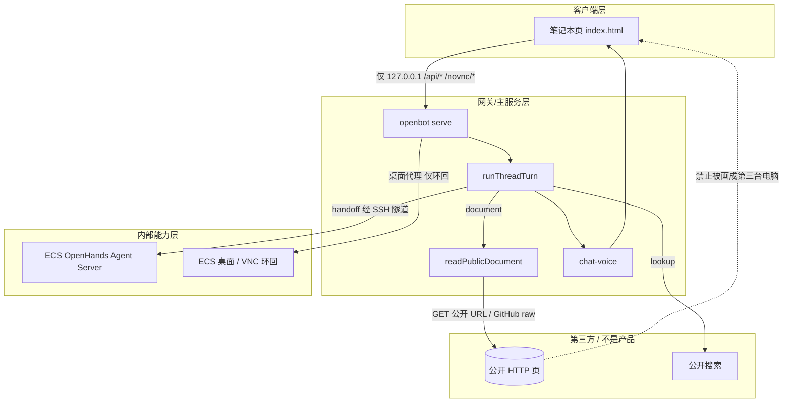
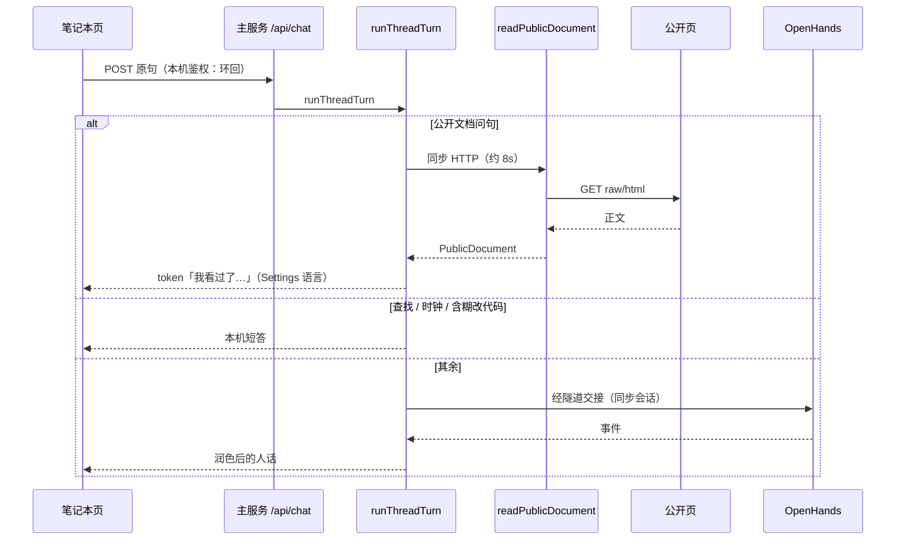

# OpenBot 智能体能力 · 技术架构

## 0. 版本历史

| 版本 | 日期 | 变更内容 | 变更原因 | 影响 |
|------|------|----------|----------|------|
| v0.1 | 2026-10-01 | 首版。文档路径落在本机主服务，不进 ECS | 现场把文档问句交接导致超时；调研拒绝 BrowserTool 作本增量 | `src/page-read.ts` 成为公开文档读取的唯一实现点 |
| v0.2 | 2026-10-01 | 分栏独立；交接不再本地 60s 放弃；仓库首页读 README | 活页三处 | `index.html` 聊天列/电脑列；`handoff.ts` 等到终态 |

## 1. 当前决策

- 当前技术决策：笔记本 OpenBot 进程是唯一对外契约（页面、`/api/chat`、桌面代理）。公开文档由该进程 HTTP GET。ECS OpenHands 只在交接路径出现。
- 当前自研边界：分流规则与口吻自研；传输复用 `fetch` + 已有 `stripHtml`。
- 当前实施边界：本增量修页面分栏、交接轮询、仓库 URL 识别。不改 SSH、不改 VNC 协议、不改 OH 客户端协议。

## 2. 分层架构

本产品没有独立认证服务、没有对象存储、没有运营后台。层按实际进程画。不适用的层标出来，避免假装有 BFF/DB。



允许的依赖：客户端 → 主服务 →（公开 HTTP | 隧道后的 OH | 环回桌面）。

禁止：页面直连 ECS、页面直连 OpenHands、页面直连 VNC 公网口、文档路径再调 OH 浏览器。

无数据库层：配置在 `~/.openbot`。无对象存储层。无独立 Auth 服务：本机单用户。

## 3. 产品到技术映射

| 需求 ID | 技术能力 | 负责模块 | 数据落点 | 验证方式 |
|---------|----------|----------|----------|----------|
| REQ-DOC-001 | 识别文档问句并抓页 | `page-read.ts` `thread.ts` | 无持久化 | 单元测试 + eval |
| REQ-DOC-002 | 文档口吻，禁止超时套话 | `chat-voice.ts` `eval-set.ts` | `~/.openbot/evals` | eval `read-public-doc` |
| REQ-DOC-003 | blob→raw | `readableDocumentUrl` | 无 | 单元测试 |
| REQ-CAP-004 | 语言 | `language.ts` `voiceFromDocument` | `~/.openbot/config.json` | 已有语言测试 + 新用例 |
| REQ-CHAT-001 | 交接后润色 | `voiceChatReply` | 无 | 旧 eval |
| REQ-CODE-001 | 交接 OH | `handoff.ts` | ECS 工作区 | 本增量不新做 |

## 4. 调用关系



失败：HTTP 非 2xx / 超时 / 空正文 → 失败人话，**不**创建 OH conversation。

可观测：测试断言 `path === "document"` 且 mock OH `creates.length === 0`。现场不写主机 IP。

## 5. 数据模型

```text
PublicDocument { title: string, text: string, url: string }
EvalCase.document?: PublicDocument
ThreadTurnResult.path: ... | "document"
```

无表、无迁移。`url` 保存人贴的原链接，请求用 `readableDocumentUrl(url)`。

## 6. API 契约

不新增 HTTP 路径。仍是：

- `POST /api/chat` `{ message }` SSE：token / done / error。
- 无 document 专用 endpoint。客户端不知道分流。

## 7. 自研边界与选型

| 候选 | 结论 |
|------|------|
| Node `fetch` + AbortSignal.timeout | 采纳 |
| Playwright / browser-use | 本增量拒绝 |
| GitHub API + token | 拒绝。公开 raw 即可 |
| 新 npm 包 readability | 拒绝。`stripHtml` + 标题/句子足够短答 |
| 把 fetch 放到 ECS | 拒绝 |

## 8. 防腐化约束

1. **页面只打本机主服务。** 验证：`src/ui` 无 ECS URL、无 OpenHands 公网。
2. **文档路径不得创建 OH 会话。** 验证：thread 测试 `creates.length === 0`。
3. **公开页不是产品电脑。** 验证：评测与文档不得把 example.com / raw.githubusercontent.com 写成「第三台机器」。
4. **密钥不进仓库与 shown。** 验证：`assertNoSecrets`、eval 红线。
5. **跨环境 URL 不得写进客户端。** 无预发/生产。桌面只 `127.0.0.1` 转发。

## 9. 失败处理、重试与回滚

- 抓取失败不重试自动连发（避免把目标站打热）。人重试。
- 回滚：还原 `page-read.ts` 与 `thread.ts` 文档分支即可，旧路径不受影响。
- 无数据回填。

## 10. 未解决问题

- JS 重页面、PDF、需登录页：未设计。
- 工作区文稿对象模型：未建，禁止用 `PublicDocument` 冒充。
