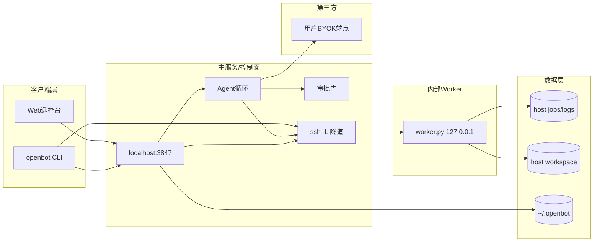
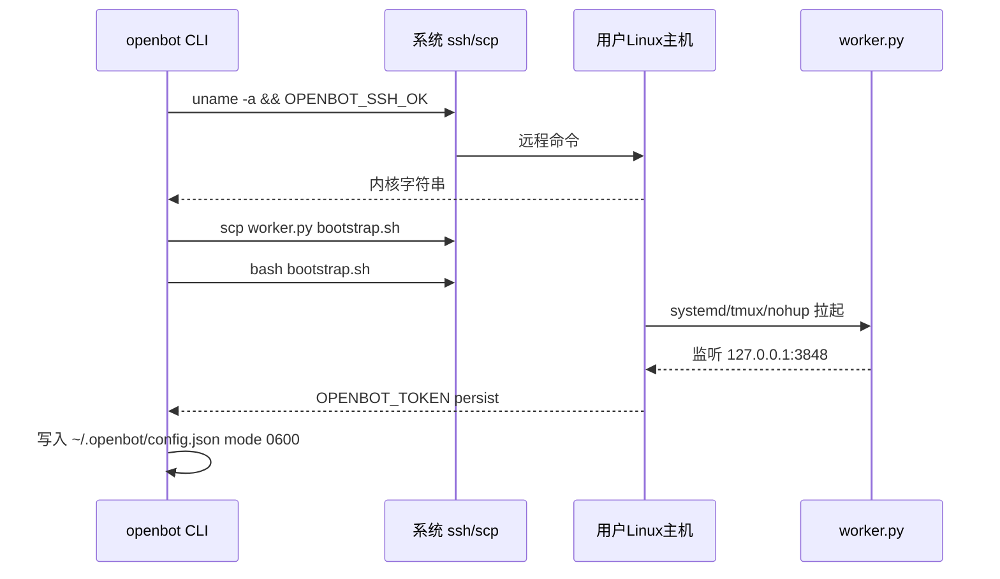
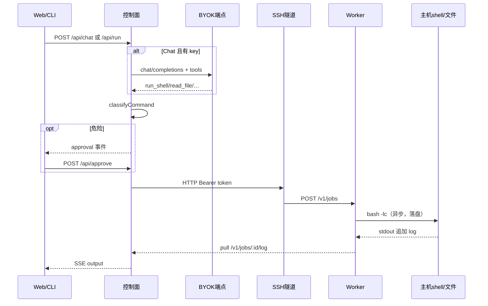

# OpenBot MVP 技术架构设计

## 0. 版本历史

| 版本 | 日期 | 变更内容 | 变更原因 | 影响 |
|------|------|----------|----------|------|
| v0.1 | 2026-09-20 | 落地分层与调用图 | 对齐 Bind/Persist/Remote；禁止客户端直连 worker 公网 | 控制面是唯一外部契约 |

根目录 `ARCHITECTURE.md` 是本文件的短索引，细节以本文为准。

## 1. 当前决策

- 当前技术决策：TypeScript 本地控制面（Node 22 标准库 HTTP）+ 系统 OpenSSH 隧道 + 远端 Python 3 stdlib worker。
- 当前自研边界：审批启发式、SSH 引导、job 协议、最小 Agent 循环。不自研 SSH 栈、不自研模型 SDK、不自研桌面。
- 当前实施边界：单仓库 `BiuBiuHu/OpenBot`。无独立 Auth 服务、无对象存储、无 SaaS 网关。

角色映射（项目事实，非通用 skill）：

| 角色 | 本项目事实 |
|------|------------|
| `<CLIENT_APP>` | `src/ui/index.html` + `openbot` CLI |
| `<PRIMARY_API>` | 本机控制面 `127.0.0.1:3847`（`src/server.ts`） |
| `<WORKER>` | 远端 `~/.openbot-worker/worker.py`，仅 `127.0.0.1:3848` |
| `<AUTH_SERVICE>` | **不适用**。无账号体系；SSH 用户即执行身份 |
| 数据层 | 远端 `jobs/*.json` + `*.log`；本机 `~/.openbot/config.json` |
| 第三方 | 用户指定的 OpenAI-compatible HTTP 端点 |

## 2. 分层架构

允许的依赖方向：客户端 → 控制面 →（SSH 隧道）→ worker → 主机 shell/文件系统。控制面 → 用户的 LLM 端点。

禁止：浏览器直连 worker、worker 持有用户模型 key、把笔记本内核输出冒充远端。



不适用的层：独立领域微服务、对象存储、邮件、Keycloak。原因：本地单用户安装，不是多租户 SaaS。

## 3. 产品到技术映射

| 需求 ID | 技术能力 | 负责模块 | 数据落点 | 验证方式 |
|---------|----------|----------|----------|----------|
| REQ-OPENBOT-001 | SSH probe + scp + bootstrap.sh | `src/ssh.ts` `worker/bootstrap.sh` | `~/.openbot/config.json` token | `openbot bind` |
| REQ-OPENBOT-002 | systemd-user / tmux / nohup | `worker/bootstrap.sh` | `persist_method` 文件 | 停控制面后再 `/health` |
| REQ-OPENBOT-003 | job HTTP + 日志轮询 | `worker/worker.py` `src/worker-client.ts` | `~/.openbot-worker/jobs` | `uname -a` |
| REQ-OPENBOT-004 | `/chat/completions` + tools | `src/agent.ts` | 仅本机 env | 无 key 报错 |
| REQ-OPENBOT-005 | 正则分类 + pending map | `src/approval.ts` | 内存审批 id | 单测 + UI |
| REQ-OPENBOT-006 | 无桌面依赖 | 文档 + worker 无 GUI | — | 审文档 |
| REQ-OPENBOT-007 | 0600 config，gitignore | `src/config.ts` | `~/.openbot` | 扫描 |
| REQ-OPENBOT-008 | npm scripts + README | 根文档 | dist/ | 新鲜构建 |

## 4. 调用关系

### 4.1 Bind



### 4.2 Remote 执行（聊天或 Run）



笔记本断开：UI/隧道消失；W 与 FS 继续；再 `serve` 只是重新开隧道读已有 jobs。

失败边界：SSH 失败不启动 job；worker 5xx 回传到 SSE `error`；模型失败不影响已在跑的 job。

## 5. 数据模型

本机 `~/.openbot/config.json`：host、worker.token、persist、llm 元数据（无强制写 key，key 走 env）。

远端 job：

```json
{
  "id": "a1b2c3d4e5f6",
  "command": "uname -a",
  "cwd": "/home/ubuntu/openbot-workspace",
  "status": "running",
  "exit_code": null,
  "created_at": 0,
  "started_at": 0,
  "finished_at": null
}
```

无共享 SQL。无迁移。

## 6. API 契约

控制面（仅 127.0.0.1）：

| 方法 | 路径 | 说明 |
|------|------|------|
| GET | `/` | UI |
| GET | `/api/status` | 主机 + persist + worker info |
| GET | `/api/jobs` | 远端 job 列表 |
| POST | `/api/run` | SSE 直接执行 |
| POST | `/api/chat` | SSE Agent |
| POST | `/api/approve` | `{id, allow}` |

Worker（仅 127.0.0.1，Bearer token）：

| 方法 | 路径 |
|------|------|
| GET | `/health` 无鉴权 |
| GET | `/v1/info` |
| POST | `/v1/jobs` |
| GET | `/v1/jobs` `/v1/jobs/:id` `/v1/jobs/:id/log` |
| POST | `/v1/jobs/:id/cancel` |
| POST | `/v1/files/read\|write\|list` |

## 7. 自研边界与选型

见 `00-research/competitor-research.md`。采纳系统 SSH + stdlib worker；拒绝 paramiko、Fastify、OpenAI SDK、默认 Docker runtime。

后续替换路径：若 worker 协议要兼容 OpenHands action server，可在控制面加适配器，不必改产品隐喻。

## 8. 防腐化约束

1. **客户端不得直连 worker**。浏览器只打 `127.0.0.1:3847`。验证：UI 源码无 worker 端口写死调用（隧道在控制面侧）。
2. **主服务是唯一外部契约**。模型 key 只在控制面。验证：`worker.py` 不读取 `OPENAI_API_KEY`。
3. **Worker 不持有用户登录态判断**。只有共享 token，没有账号会话。验证：无 cookie/session 代码。
4. **禁止跨环境兜底到“假装本机就是远端”**。未 bind 必须失败。验证：`run`/`serve` 无 token 即报错。
5. **临时脚本不得成为业务入口**。入口是 `npx openbot` / `node dist/cli.js`。

## 9. 失败处理、重试与回滚

- Bind 失败：保留旧 token/进程，打印 bootstrap 日志。
- 隧道断开：控制面报 worker unreachable；job 继续。
- 回滚：停 systemd/tmux/nohup；删 `~/.openbot` 不影响主机文件，除非用户再发命令。

## 10. 未解决问题

- 多主机配置文件格式、worker 升级通道：Backlog。
