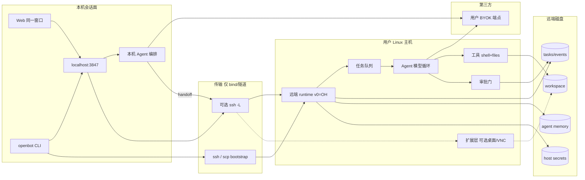
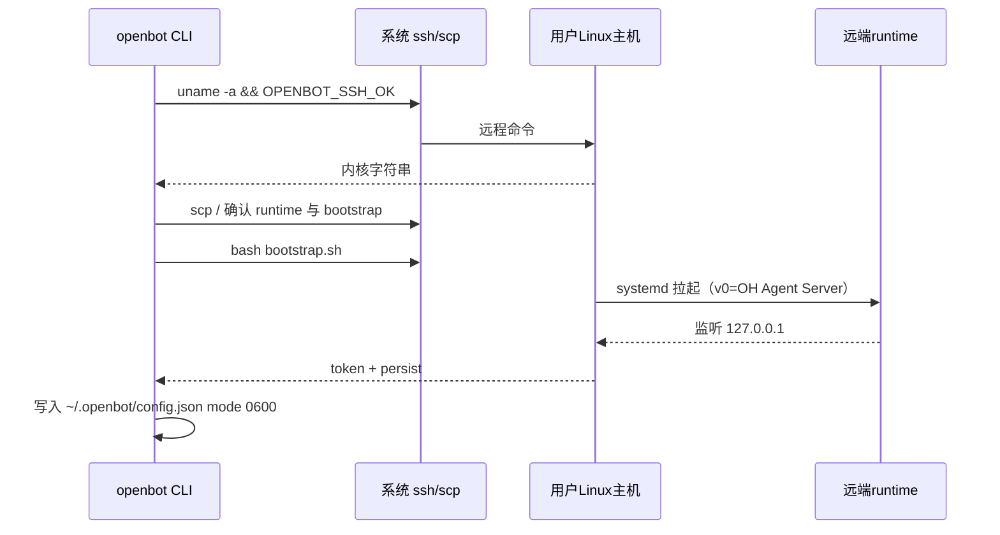
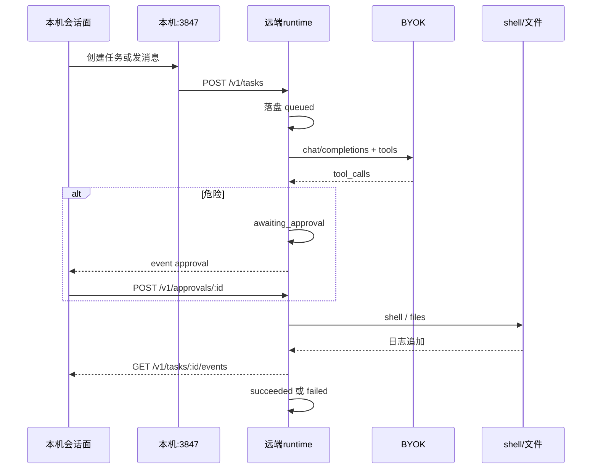
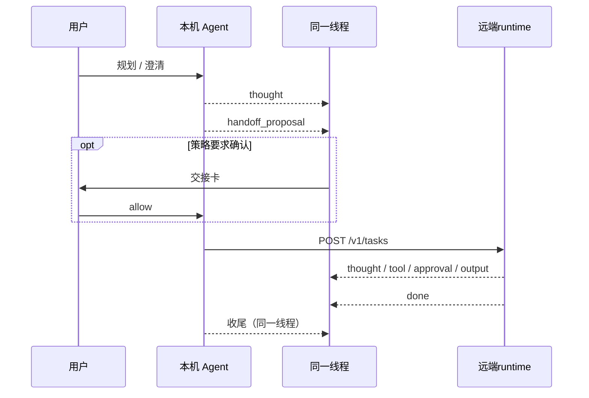

# OpenBot MVP 技术架构设计

## 0. 版本历史

| 版本 | 日期 | 变更内容 | 变更原因 | 影响 |
|------|------|----------|----------|------|
| v0.1 | 2026-09-20 | 落地分层与调用图 | 对齐 Bind/Persist/Remote；禁止客户端直连 worker 公网 | 控制面是唯一外部契约 |
| v0.2 | 2026-09-20 | 远端常驻 **openbot-agent**；本机变瘦客户端；补 1:1 / 群组对话分层 | 用户确认：远端是 think+execute 的 Agent，不是哑 Worker；本地聊天要能跟 Agent 与 Agent 群说话 | 模型循环与任务状态迁到远端盘；群组不阻塞 Agent 内核 |
| v0.3 | 2026-09-21 | 同一窗口三种会话：本机 LLM / Agent 1:1 / 群组；默认本机 LLM | **聊天 ≠ 总是 Agent**；头脑风暴不必上 VPS | 本机保留 NL BYOK；Agent 模式才建远端任务 |
| v0.4 | 2026-09-21 | 一条线程：本机 Agent 规划 → 交接远端 → 结果回流 → 本机收尾 | 不是三个对等 mode 来回切 | 本机 Agent=编排同伴；远端=拥有电脑 |
| v0.5 | 2026-09-22 | v0 远端执行后端定为 OpenHands Agent Server | 出货速度；ECS 已证明 | 自建 `openbot-agent` 延后；见 [runtime-decision-v0.md](runtime-decision-v0.md) |
| v0.6 | 2026-09-22 | 补扩展层：桌面/VNC 等 OH 缺口由 OpenBot 外挂 | 用户点名无可见屏幕；避免 OH-only forever | 不挡 v0；不 fork OH |

根目录 `ARCHITECTURE.md` 是本文件的短索引。v0 runtime 决策见 **[runtime-decision-v0.md](runtime-decision-v0.md)**。交接与以后 native 草图见 **[remote-agent.md](remote-agent.md)**。细节冲突时以本目录这三篇为准。

## 1. 当前决策

- **v0 锁定（2026-09-22）**：远端 **Agent runtime** = **OpenHands Agent Server**。本仓库自建本机 app shell + BYOK + SSH bind/bootstrap + 同一线程顺序交接 + **扩展层**（OH 缺的能力）。OH 是 **dependency / remote runtime plugin**，不整仓 fork。全文：[runtime-decision-v0.md](runtime-decision-v0.md)；试装：[openhands-agent-server-trial.md](../06-ops/openhands-agent-server-trial.md)。
- **本机角色**：**本机 Agent**（思考 / 编排同伴）+ 会话面。默认用笔记本 BYOK 规划、澄清、起草。需要电脑时**交接**给远端 runtime，结果回到**同一条线程**，再由本机 Agent 收尾。不是三个对等聊天 mode 让用户来回切。
- **远端角色**：拥有电脑的运行时。v0 这台电脑上的 **Agent 循环 / 工具 / 事件** 是 OH Agent Server。命令、文件先发生在这里。
- **扩展层（OpenBot 拥有）**：OH 没有的能力由本仓库 **外挂** 到同一台 BYO 机器。第一缺口：**无桌面 / 无 VNC / 无实时可见屏幕**。以可选 sidecar / plugin 挂在 OH **旁边**，不 fork OH。**v0 不必出货**，近端必须占位（BL-017）。
- **SSH 职责**：只做 bind / bootstrap，以及可选的 `ssh -L` 隧道。SSH **不是**命令通道，也不是 Agent。只跟本机 Agent 规划时**不需要** bind。
- **v0 进程形态**：2C4G 上 **一个**远端 Agent runtime 进程（OH）。本机控制面另有本机 Agent 循环（随笔记本）。不拆微服务，也不为 v0 再自建 `openbot-agent`。桌面 / VNC sidecar 是近端可选进程，不是 v0 常驻门禁。
- **以后可选**：自建 systemd `openbot-agent` 可作为 native runtime 回来，不挡 v0。
- **工具 v0**：shell + 文件，且**只在远端**。本机 Agent 无 VPS 工具，只负责想和交接。无头浏览是后续 **plugin**（BL-012），与可见桌面 / VNC（BL-017）不是同一项。
- **群组**：v0.5 以后。不阻塞本机交接或远端 runtime。

被拒绝的替代：

- 远端只当哑 Worker；远端任务的循环永远留在笔记本（合盖即停执行）。
- 三个对等聊天 mode（本机 LLM / 远端 1:1 / 群组）让用户自己切换。
- 把每一条本机规划都静默变成远端任务。
- 把 computer-use / 像素桌面叫成“Agent”。
- 托管 Firecracker 舰队，或宣称 Grok 桌面对等。
- v0 上多进程拆分（agent / tool-runner / event-bus）。
- 为 v0 fork OpenHands 整仓，或把 OH 控制台当产品 UI。
- 把自建 `openbot-agent` 当成 v0 门禁。
- 为了桌面 / VNC 去 fork OH；或把「v0 不出桌面」写成永远不做。

### 1.0 一条线程：规划 → 交接 → 执行 → 收尾

```text
你 ──NL──► 本机 Agent（想 / 编排，笔记本 BYOK）
              │
              │ 需要电脑时：提出交接（跑命令、改文件、以后浏览）
              │ 策略要求则等人确认
              ▼
         远端 runtime（v0: OpenHands Agent Server；拥有这台电脑）
              │
              │ 任务事件流回同一条线程
              ▼
         本机 Agent 收尾（解释、下一步、再规划）
```

| 角色 | 谁在想 | 有没有电脑 | 合盖 |
|------|--------|------------|------|
| **本机 Agent** | 笔记本控制面 → 本机 BYOK | **没有**。只规划、澄清、起草、提出交接 | 本机思考中断（可接受） |
| **远端 runtime（v0 = OH Agent Server）** | 主机上的循环 → 主机 BYOK | **有**。shell / 文件 / 以后浏览 + 审批 | 已交接的任务继续 |
| **群组** | 多名远端 Agent | 各机自己的电脑 | v0.5 |

交接规则：

1. 本机 Agent 判断“这步需要主机”时发出 `handoff_proposal`（目标主机、goal、原因），**不**自己跑 VPS 命令。
2. 策略要求确认时，同一线程出一张交接卡；用户允许后才 `POST /v1/tasks`。只读探活类策略以后再收紧，v0 默认**先问再交接**。
3. 远端事件（thought / tool / approval / output）画进**同一条** `thread_id`，标 `remote`。
4. 任务终态后本机 Agent 自动接话收尾。用户不用切 mode。
5. 禁止把交接前的整段闲聊重放成 shell；只把提案里的 `goal`（加用户确认的上下文）交给远端。

### 1.1 名词：Worker ≠ 本机 Agent ≠ 远端 Agent ≠ computer-use

| 词 | 含义 | 本仓库位置 |
|----|------|------------|
| **Worker** | 只执行：接 job、跑 shell/文件、写日志。不思考。 | PR#1 的 `worker.py`（执行原语，迁移后内嵌为远端 Agent 的 tool runtime） |
| **本机 Agent** | 思考 / 编排同伴：规划、澄清、起草；提出向远端交接。无 VPS 工具。 | 本机控制面；笔记本 BYOK |
| **远端 runtime** | 拥有电脑：排队、想、执行、审批。v0 = OpenHands Agent Server；以后可选自建 `openbot-agent`。 | 主机常驻进程 |
| **computer-use** | 一类工具（无头浏览）。 | BL-012；**不是**任何一种 Agent |
| **扩展层** | OH 缺的能力：先点名桌面 / VNC / 可见屏幕；以后 connectors | OpenBot plugin / sidecar，挂在同一台 BYO 机器、OH 旁边。**不挡 v0**；不 fork OH |
| **瘦客户端 / 会话面** | 同一条线程的 UI/CLI；转发交接、订事件、批准。 | `src/ui`、`src/cli.ts`、`127.0.0.1:3847` |
| **编排器** | 群组里决定“谁开口 / 谁动手”。v0 的编排就是本机 Agent 的交接。 | v0.5 才多 Agent |

### 1.2 从 PR#1 迁移（不合并、不推翻绑定故事）

PR#1（`cursor/openbot-mvp-a7b3`）已交付：SSH bind/bootstrap、执行原语、本机 Agent 循环、本机审批、远端 job 落盘。

| 保留 | 迁走 / 改变 |
|------|-------------|
| SSH probe + scp + bootstrap 安装路径 | 需要电脑的循环：`src/agent.ts` 的执行部分 → 远端 runtime（v0 = OH）。本机 Agent **留下**作编排同伴 |
| 执行原语：shell、读/写/列目录、job 日志、仅 `127.0.0.1` | 已交接任务以远端盘为权威 |
| persist 降级：systemd-user → tmux → nohup | 本机仍跑编排循环；执行与任务状态在远端 |
| 危险命令先批准（产品门，不是沙箱） | 另加**交接确认**（策略要求时）。远端 BYOK 在主机 `secrets/`；本机 Agent 用 `~/.openbot/.env` |
| 本机 `POST /api/chat` 调模型 | **留下**给本机 Agent（规划、无 VPS tools）；交接后才 `POST /v1/tasks` |
| 浏览器不直连远端端口 | Worker 进程名演进为远端 Agent；`/v1/jobs` 升到 `/v1/tasks` |

角色映射（项目事实）：

| 角色 | PR#1 事实 | 目标事实 |
|------|-----------|----------|
| `<CLIENT_APP>` | `src/ui/index.html` + CLI | 仍是；同一条线程 + 本机 Agent + 交接/批准 |
| `<PRIMARY_API>` | 本机 `127.0.0.1:3847` | 本机仍只绑回环；**已交接任务**的权威 API 在远端 |
| `<AGENT>` | 本机 `src/agent.ts`（循环+执行） | **拆成**：本机 Agent（编排）+ 远端 runtime（v0 = OH，有电脑） |
| `<WORKER>` | 远端 `worker.py` | 不再作为对外产品名；执行内核留在远端 Agent 内 |
| `<AUTH_SERVICE>` | 不适用 | 仍不适用。SSH 用户 = 该主机执行身份 |
| 数据层 | 远端 `jobs/`；本机 `~/.openbot` | v0：OH 侧落盘 + 本机线程 / `.env`；以后 native 才用 `~/.openbot-agent/` |
| 第三方 | 用户 BYOK HTTP | **两处**：本机 Agent 用笔记本 key；远端循环用主机 key |

## 2. 分层架构

允许的依赖方向：

```text
本机 Agent（笔记本 BYOK，无 VPS 工具）
    │ 规划 / 澄清 / 起草
    │ handoff_proposal →（策略则确认）
    ▼
（可选 SSH 隧道）→ 远端 runtime（v0: OH Agent Server）→ 主机 BYOK
                         ↘ 工具（shell / 文件）
                         ↘ 审批门
    │ 事件回流同一线程
    ▼
本机 Agent 收尾
```

禁止：浏览器直连 Agent 公网端口；把笔记本内核输出冒充远端；把 computer-use 画成独立“Agent 层”；v0 再拆一套微服务。



不适用的层：独立领域微服务、对象存储、邮件、Keycloak、托管预发。原因：单用户自托管，2C4G 单进程。

## 3. 进程与落盘

目标主机（一台 2C4G）上的常驻面：

| 进程 / 目录 | 角色 | 生命周期 | 备注 |
|-------------|------|----------|------|
| `openhands-agent-server`（v0） | Agent 循环 + 工具 + 事件 | 试装为 systemd（见 ops trial） | **v0 远端 Agent runtime**。只听 `127.0.0.1` |
| 扩展 sidecar（近端） | 可选桌面 / VNC / 可见屏幕 | 用户开关；不挡 v0 | 同一台 BYO 机器、OH **旁边**；不进 OH fork。BL-017 |
| `openbot-agent`（以后可选） | 自建 native 循环 | systemd-user（降级 tmux / nohup） | 不挡 v0；草图见 remote-agent.md |
| `~/openbot-workspace` | 工作区文件 | 随用户文件 | Agent 的“电脑桌面”；不是沙箱 |
| 远端 tasks/events | 任务与事件 | 合盖后仍在 | v0 落在 OH 侧；native 时见 `~/.openbot-agent/` |
| 远端 secrets | BYOK 与 bind / session token | mode `0600` | **不进仓库**；不对公网暴露 |
| `sshd` | 已有系统服务 | 发行版管理 | 只用于 bind 与可选隧道 |

本机（可关、可合盖）：

| 进程 / 目录 | 角色 | 生命周期 |
|-------------|------|----------|
| `openbot serve` / CLI | 会话面、本机 Agent、交接/审批 UI、隧道 | 随笔记本 |
| `~/.openbot/config.json` | host、隧道端口、agent token 副本、当前线程 | 本机配置 |
| 本机 `~/.openbot/.env` | **本机 Agent** 的 BYOK | 合盖即停本机思考；不代替主机 key |

PR#1 的 `~/.openbot-worker/` 在迁移实现时重命名或兼容读取；产品名统一为 Agent。

## 4. 产品到技术映射

| 需求 ID | 技术能力 | 负责模块（目标） | 数据落点 | 验证方式 |
|---------|----------|------------------|----------|----------|
| REQ-OPENBOT-001 | SSH probe + scp + bootstrap | `src/ssh.ts` + 主机 bootstrap | 本机 config + 远端 token | `openbot bind` 让远端 runtime 可达（v0 = OH） |
| REQ-OPENBOT-002 | 常驻 + 远端盘状态 | systemd + 远端 runtime 落盘 | 主机 OH / 以后 `~/.openbot-agent` | 停本机后再看任务仍在、模型循环可继续 |
| REQ-OPENBOT-003 | 远端循环 + shell/文件 | v0 = OH Agent Server | tasks + workspace | 合盖后任务从 queued 走到终态 |
| REQ-OPENBOT-004 | BYOK 分两处：本机 Agent 用笔记本 key；远端用主机 secrets | 控制面 / 远端 Agent | `~/.openbot/.env` 与主机 `secrets/` | 无对应 key 时该步失败；`run` 仍可用 |
| REQ-OPENBOT-005 | 审批门 | Agent 停在 `awaiting_approval` | 任务事件 | 单测 + UI 卡片 |
| REQ-OPENBOT-006 | 无桌面、无 Firecracker 声明 | 文档 + 无 GUI 依赖 | — | 审文档 |
| REQ-OPENBOT-007 | 密钥不入库 | gitignore + 0600 | `~/.openbot*` | 扫描 |
| REQ-OPENBOT-008 | 安装路径可构建 | README + npm | dist/ | 新鲜构建 |
| REQ-OPENBOT-009 | 交接后远端事件回到同一线程 | 本机 Agent + `/v1/tasks` | 远端任务 + 本机线程 | 不切窗口 |
| REQ-OPENBOT-010 | Agent 群组 | 房间 + 扇出 | 以后 | v0.5；不挡内核 |
| REQ-OPENBOT-011 | 本机 Agent（规划同伴）+ 交接提案 | 本机控制面 | 本机线程 | 未 bind 也能规划；要电脑才提案 |

## 5. 调用关系

### 5.1 Bind / bootstrap（保留）



### 5.2 任务（权威在远端）

笔记本断开：会话面与隧道消失；**Agent、队列、模型循环、工具、tasks 文件继续**。再 `serve` 只是重新开隧道，订阅已有事件。



失败边界：SSH/bind 失败不启动 Agent；隧道断开不影响已在跑的任务；模型失败把任务标 `failed`，已落盘的副作用不回滚（文档写明）。

### 5.3 本机 Agent（默认，同一线程）

用户只跟本机 Agent 说话。`POST /api/chats/:id/messages` → 笔记本 BYOK。SSE：`thought` / `handoff_proposal` / `error` / `done`。未 bind、隧道断开都不妨碍**规划**。合盖中断本机生成；已交接的远端任务继续。

### 5.4 交接（handoff）



细节与 `handoff_proposal` 字段见 [remote-agent.md](remote-agent.md) §6。

### 5.5 群组（v0.5，不阻塞）

以后：一条线程里本机 Agent 可向多名远端 Agent 扇出交接。v0 只交接一台已 bind 主机。见 remote-agent.md §6.2。

## 6. 任务生命周期

权威状态机（远端盘）：

```text
queued → running → awaiting_approval → running → succeeded
                 ↘ failed
                 ↘ cancelled
                 ↘ timeout
```

| 状态 | 含义 | 谁推进 |
|------|------|--------|
| `queued` | 已落盘，等模型循环取走 | Agent |
| `running` | 正在思考或执行工具 | Agent |
| `awaiting_approval` | 危险动作已检出，等人 | 本机会话面 `allow|deny` |
| `succeeded` | 终态 | — |
| `failed` | 终态（模型/工具/策略） | — |
| `cancelled` | 用户或客户端取消 | 会话面 |
| `timeout` | 超过 `timeout_sec` | Agent |

`awaiting_approval` 不是独立产品对象：它是任务的一个可恢复状态。批准后回到 `running`；拒绝则 `failed`（原因 `denied`）或按策略跳过该工具继续（实现时二选一，默认 **拒绝即失败该工具轮次**）。

PR#1 的 job 状态（queued/running/succeeded/failed/…）降为任务内部的 **tool step**，不再当对外主对象。

## 7. 数据模型

本机 `~/.openbot/config.json`：host、agent token、persist、当前 `thread_id`。本机 Agent 的 key 走 `~/.openbot/.env`，不强制与主机 key 相同。一条线程一个 `thread_id`，交接前后不变。

远端任务（权威）：

```json
{
  "id": "tsk_a1b2c3d4e5f6",
  "agent_id": "host:default",
  "thread_id": "chat_1to1_default",
  "goal": "uname -a 并解释",
  "status": "running",
  "source": { "type": "chat", "chat_id": "chat_1to1_default", "message_id": "msg_01" },
  "created_at": 0,
  "updated_at": 0,
  "finished_at": null
}
```

无共享 SQL。无迁移框架。JSON 文件 + append-only 事件日志。

群组房间元数据可以先放本机或编排器主机；**每个 Agent 的任务仍只写在自己的盘上**。

## 8. API 契约

本机会话代理（仅 `127.0.0.1`，给浏览器用）：

| 方法 | 路径 | 说明 |
|------|------|------|
| GET | `/` | 会话 UI |
| GET | `/api/status` | 主机 + persist + agent 是否可达 |
| GET | `/api/chats` | 线程列表（不是 mode 列表） |
| POST | `/api/chats` | 建一条线程（默认本机 Agent） |
| POST | `/api/chats/:id/messages` | 交给本机 Agent |
| GET | `/api/chats/:id/events` | 本机 thought + 远端回流 + 交接/审批卡 |
| POST | `/api/handoffs/:id` | `{allow}` 确认或拒绝交接 |
| POST | `/api/approve` | 转发远端工具审批 |
| POST | `/api/run` | 不经模型的直执（可映射为无循环 task） |

远端 Agent（仅 `127.0.0.1`，Bearer token）。完整草图见 [remote-agent.md](remote-agent.md)：

| 方法 | 路径 |
|------|------|
| GET | `/health` `/v1/info` |
| POST | `/v1/tasks` |
| GET | `/v1/tasks` `/v1/tasks/:id` `/v1/tasks/:id/events` |
| POST | `/v1/tasks/:id/cancel` |
| POST | `/v1/approvals/:id` |
| POST | `/v1/files/read\|write\|list`（执行原语，供自身工具与调试） |

PR#1 `/v1/jobs` 在迁移完成前可继续存在，作为内部 tool step。

## 9. 对话分层

| 层 | 是什么 | 不是什么 |
|----|--------|----------|
| 本机聊天 UI | **一条线程**的会话面 | 不是三个对等 mode 切换器 |
| 本机 Agent | 思考 / 编排同伴（笔记本 BYOK） | 没有电脑；合盖停规划是预期 |
| 远端 runtime | 拥有电脑（v0 = OH Agent Server） | 不是用户日常对谈的那一位 |
| 交接 | 本机提案 →（确认）→ `POST /v1/tasks` → 事件回流 | 不是用户手动“切到远端聊天” |
| 扩展层 | OH 缺口（桌面/VNC 等）挂在同一台机器旁边 | 不是 OH fork，不是 v0 门禁，不是第三个 mode |

用户始终跟本机 Agent 说话。需要电脑时由它交接。群组 v0.5。不要为了群组先拆单进程远端内核。

## 10. 自研边界与选型

见 `00-research/competitor-research.md`。仍采纳系统 SSH + stdlib HTTP；拒绝 paramiko、默认 Docker runtime、把 OpenHands 控制台当产品隐喻。**v0 把 OH Agent Server 当远端 Agent runtime plugin**，不是整仓 fork，也不是产品 UI。

后续替换路径：本机壳的 runtime adapter 先对接 OH；以后可选再接自建 `openbot-agent`。不必改“这台主机就是我的电脑”。

**扩展层**（OpenBot 拥有）：OH 缺的能力以 **plugin / sidecar** 挂在同一台 BYO 机器、OH **旁边**。第一缺口是桌面 / VNC / 可见屏幕（BL-017，不挡 v0）。无头浏览另走 BL-012。禁止为了补缺口去 fork OH。详见 [runtime-decision-v0.md](runtime-decision-v0.md) §3.1。

## 11. 防腐化约束

1. **客户端不得直连 Agent 公网端口**。浏览器只打 `127.0.0.1:3847`。
2. **已交接任务的权威在远端**。本机不得在隧道断开后假装本地继续执行。本机 Agent 的规划本来就在本地，合盖中断即可。验证：合盖场景以远端 `tasks/` 为准。
3. **模型 key 跟循环走**：本机 Agent → `~/.openbot/.env`；远端 → 主机 `secrets/`。都不入库。
4. **Worker 不再是对外产品名**。文档与 UI 说 Agent；执行原语可以仍叫 job/step。
5. **computer-use ≠ Agent**。禁止把浏览器插件画成第二套常驻人格，除非它只是工具。
6. **未 bind 时交接与 Run 必须失败**。本机 Agent 规划仍可用。禁止把笔记本内核输出标成 host。
7. **入口仍是 `npx openbot`**。临时脚本不得成为业务入口。
8. **群组不升级权限**。编排器只能投递任务；每台主机的审批门仍在该 Agent 上。
9. **禁止静默交接**。v0 默认先提案再执行；不得把整段本机规划重放成 shell。
10. **扩展挂在 OH 旁边**。桌面 / VNC / 以后 connectors 是本仓库扩展层，不是 OH fork，也不是第二个 Agent。v0 可不出货，文档不得写成永远不做。

## 12. 失败处理、重试与回滚

- Bind 失败：保留旧 token/进程，打印 bootstrap 日志。
- 隧道断开：本机 Agent 仍能规划；交接失败并说清原因；已在跑的远端任务继续。
- 审批超时：任务 `timeout` 或保持 `awaiting_approval`（实现选后者作 v0，避免自动续跑危险命令）。
- 回滚：停 systemd/tmux/nohup；删 `~/.openbot` 不影响主机 workspace，除非用户再发命令。
- 从 PR#1 回滚本设计：本 PR 只改文档；实现未落地前无运行时回滚。

## 13. 未解决问题

- 多主机配置文件格式、Agent 热升级：Backlog。
- 群组房间权威落在本机还是某台“lead”主机：v0.5 再锁；默认本机房间 + 远端任务。
- PR#1 `jobs/` 目录的兼容读取窗口：实现 Phase 1 时写适配，不在本文拍死亡日期。
- 桌面 / VNC sidecar 的具体协议与 2C4G 成本：BL-017 实现时再锁；本文只锁「同一台机器、OH 旁边、不 fork」。
