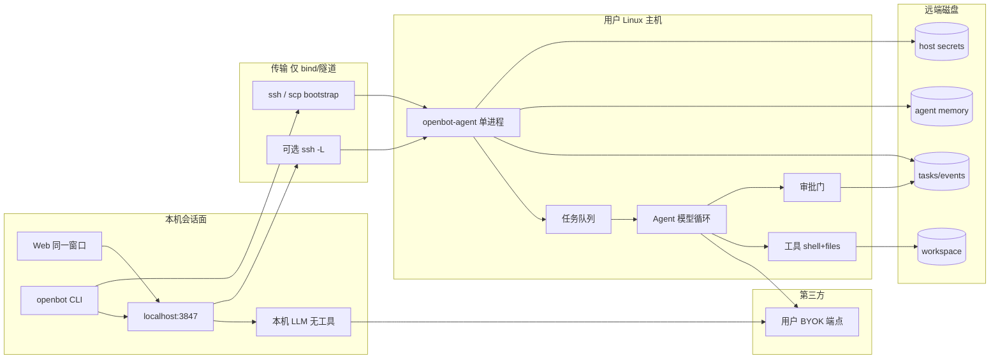
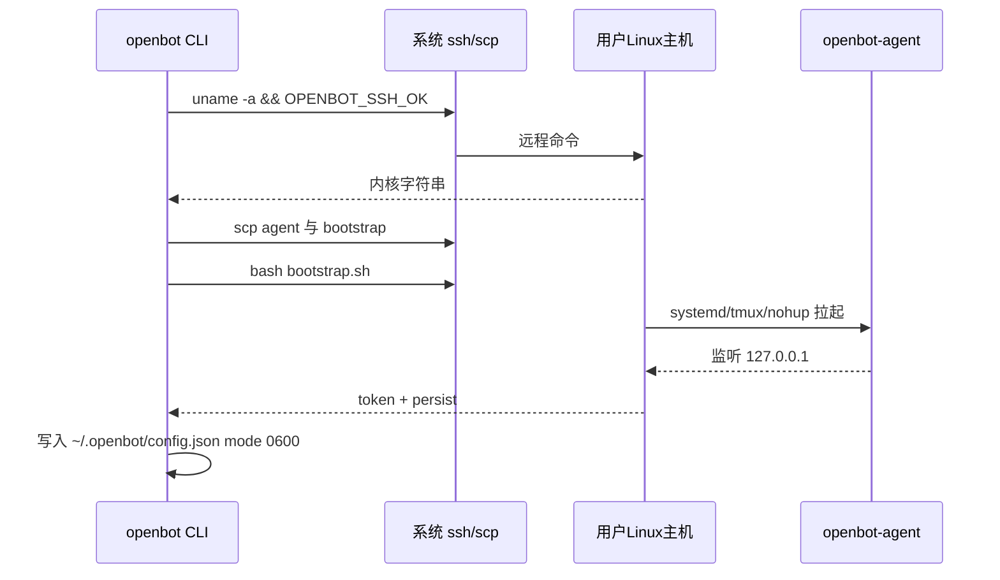

# OpenBot MVP 技术架构设计

## 0. 版本历史

| 版本 | 日期 | 变更内容 | 变更原因 | 影响 |
|------|------|----------|----------|------|
| v0.1 | 2026-09-20 | 落地分层与调用图 | 对齐 Bind/Persist/Remote；禁止客户端直连 worker 公网 | 控制面是唯一外部契约 |
| v0.2 | 2026-09-20 | 远端常驻 **openbot-agent**；本机变瘦客户端；补 1:1 / 群组对话分层 | 用户确认：远端是 think+execute 的 Agent，不是哑 Worker；本地聊天要能跟 Agent 与 Agent 群说话 | 模型循环与任务状态迁到远端盘；群组不阻塞 Agent 内核 |
| v0.3 | 2026-09-21 | 同一窗口三种会话：本机 LLM / Agent 1:1 / 群组；默认本机 LLM | **聊天 ≠ 总是 Agent**；头脑风暴不必上 VPS | 本机保留 NL BYOK；Agent 模式才建远端任务 |

根目录 `ARCHITECTURE.md` 是本文件的短索引。远端进程、任务状态机、HTTP 草图见 **[remote-agent.md](remote-agent.md)**。细节冲突时以本目录这两篇为准。

## 1. 当前决策

- **目标架构（已确认）**：用户 Linux 主机上跑一个 systemd 常驻的单进程 `openbot-agent`。它自带任务队列、BYOK 模型循环、工具、审批门；任务与状态落在**远端磁盘**，合上笔记本也不丢。
- **本机角色**：同一聊天窗口的**会话面**。三种模式见 §1.0。对 Agent 模式它是瘦客户端（建任务、订事件、批准）；对 **本机 LLM** 模式它在笔记本上跑**无工具**的 NL 对话（BYOK）。
- **SSH 职责**：只做 bind / bootstrap，以及可选的 `ssh -L` 隧道。SSH **不是**命令通道，也不是 Agent。本机 LLM 模式**不需要** bind。
- **v0 进程形态**：2C4G 上 **一个** Agent 进程。不拆微服务、不引入独立队列服务、不引入独立 Auth。
- **工具 v0**：shell + 文件，且**只在 Agent 模式**。本机 LLM 无 VPS 工具。无头浏览器 / computer-use 是后续 **plugin**，不是 Agent 本体。
- **对话 ≠ Agent**：默认会话可以是本机 LLM。用户点选 Agent/主机或 `@mention` 才升级到远端。群组编排不阻塞 Agent 内核。

被拒绝的替代：

- 远端只当哑 Worker；**Agent 任务**的模型循环永远留在笔记本（合盖即停思考）。本机 LLM 会话本来就该停在笔记本。
- 把每一条本机聊天都当成远端任务。
- 把 computer-use / 像素桌面叫成“Agent”。
- 托管 Firecracker 舰队，或宣称 Grok 桌面对等。
- v0 上多进程拆分（agent / tool-runner / event-bus）。

### 1.0 同一窗口的三种会话

| 模式 | 谁在想 | 工具 / 副作用 | 合盖 | v0 默认 |
|------|--------|----------------|------|---------|
| **本机 LLM** | 笔记本控制面 → 用户 BYOK | **无**远端工具，不上 VPS | 会话中断（可接受） | **是** |
| **远端 Agent 1:1** | `openbot-agent` | shell / 文件 + 审批 | 任务继续 | 用户点选 Agent/主机后 |
| **Agent 群组** | 多名 Agent（可多机） | 各机自己的工具 | 各任务继续 | v0.5 |

升级路径：本机 LLM 线程里点选一台已 bind 的 Agent/主机，或 `@agent_id`，把**下一条**（或用户确认后的这条）目标变成远端任务。不要静默把整段头脑风暴重放成 VPS 命令。

### 1.1 名词：Worker ≠ Agent ≠ computer-use ≠ 本机 LLM

| 词 | 含义 | 本仓库位置 |
|----|------|------------|
| **Worker** | 只执行：接 job、跑 shell/文件、写日志。不思考。 | PR#1 的 `worker.py`（执行原语，迁移后内嵌为 Agent 的 tool runtime） |
| **Agent（`openbot-agent`）** | 思考 + 执行：排队、调模型、选工具、停在审批、写状态。 | 目标远端常驻进程 |
| **computer-use** | 一类工具（无头浏览 / 像素桌面）。 | v0 不做；v1+ plugin。**不是** Agent |
| **本机 LLM** | 笔记本上的普通 NL 对话：改写、问答、头脑风暴。无工具、无任务队列。 | 本机控制面 `POST /api/chats`（`mode=local_llm`） |
| **瘦客户端** | 本机 Web/CLI：会话面；Agent 模式下创建任务、订阅事件、批准。 | `src/ui`、`src/cli.ts`、本机 `127.0.0.1:3847` |
| **编排器** | 群组里决定“谁开口 / 谁动手”。可以是本机或某台远端 Agent。 | v0.5；v0 不需要 |

### 1.2 从 PR#1 迁移（不合并、不推翻绑定故事）

PR#1（`cursor/openbot-mvp-a7b3`）已交付：SSH bind/bootstrap、执行原语、本机 Agent 循环、本机审批、远端 job 落盘。

| 保留 | 迁走 / 改变 |
|------|-------------|
| SSH probe + scp + bootstrap 安装路径 | **Agent** 模型循环：`src/agent.ts` → 远端 `openbot-agent`。本机 LLM 循环留在笔记本且无 tools |
| 执行原语：shell、读/写/列目录、job 日志、仅 `127.0.0.1` | 任务与对话状态：以远端盘为权威，本机只缓存视图 |
| persist 降级：systemd-user → tmux → nohup | Agent 模式下本机收缩为会话面 + 隧道 + 审批转发 |
| 危险命令先批准（产品门，不是沙箱） | Agent 的 BYOK 落到主机 `secrets/`；**本机 LLM 仍用笔记本** `~/.openbot/.env` |
| 本机 `POST /api/chat` 调模型 | **留下**给本机 LLM 模式（无 tools）；Agent 1:1 改为 `POST /v1/tasks` |
| 浏览器不直连远端端口 | Worker 进程名演进为 Agent；协议从 `/v1/jobs` 升到 `/v1/tasks`（jobs 可作 task 的 tool 子步骤） |

角色映射（项目事实）：

| 角色 | PR#1 事实 | 目标事实 |
|------|-----------|----------|
| `<CLIENT_APP>` | `src/ui/index.html` + CLI | 仍是；会话面 + 本机 LLM + Agent 模式下的批准/订阅 |
| `<PRIMARY_API>` | 本机 `127.0.0.1:3847` | 本机仍只绑回环；**权威任务 API 在远端 Agent**（经隧道访问） |
| `<AGENT>` | 本机 `src/agent.ts` | 远端 `openbot-agent`（单进程） |
| `<WORKER>` | 远端 `worker.py` | 不再作为对外产品名；执行内核留在 Agent 内 |
| `<AUTH_SERVICE>` | 不适用 | 仍不适用。SSH 用户 = 该主机执行身份 |
| 数据层 | 远端 `jobs/`；本机 `~/.openbot` | Agent：远端 `~/.openbot-agent/{tasks,events,memory,secrets}`。本机 LLM：本机会话缓存 + `~/.openbot/.env` |
| 第三方 | 用户 BYOK HTTP | **两处都可**：本机 LLM 用笔记本 key；Agent 循环用主机 key。不要用笔记本 key 去冒充“在 VPS 上想” |

## 2. 分层架构

允许的依赖方向：

```text
本机会话面 ── mode=local_llm ──► 笔记本 BYOK LLM     （无工具、无 VPS）
           ── mode=agent_*  ──►（可选 SSH 隧道）→ openbot-agent → 主机 BYOK LLM
                                                              ↘ 工具（shell / 文件）
                                                              ↘ 审批门
```

禁止：浏览器直连 Agent 公网端口；把笔记本内核输出冒充远端；把 computer-use 画成独立“Agent 层”；v0 再拆一套微服务。



不适用的层：独立领域微服务、对象存储、邮件、Keycloak、托管预发。原因：单用户自托管，2C4G 单进程。

## 3. 进程与落盘

目标主机（一台 2C4G）上的常驻面：

| 进程 / 目录 | 角色 | 生命周期 | 备注 |
|-------------|------|----------|------|
| `openbot-agent` | 思考 + 执行 + HTTP | systemd-user（降级 tmux / nohup） | **唯一**常驻业务进程。监听 `127.0.0.1` |
| `~/openbot-workspace` | 工作区文件 | 随用户文件 | Agent 的“电脑桌面”；不是沙箱 |
| `~/.openbot-agent/tasks/` | 任务 JSON + 事件日志 | 合盖后仍在 | 权威状态 |
| `~/.openbot-agent/memory/` | 该 Agent 私有记忆 | 跨任务保留 | 群组里不对其他 Agent 默认可见 |
| `~/.openbot-agent/secrets/` | BYOK 与 bind token | mode `0600` | **不进仓库**；不对公网暴露 |
| `sshd` | 已有系统服务 | 发行版管理 | 只用于 bind 与可选隧道 |

本机（可关、可合盖）：

| 进程 / 目录 | 角色 | 生命周期 |
|-------------|------|----------|
| `openbot serve` / CLI | 会话面、本机 LLM、审批 UI、隧道 | 随笔记本 |
| `~/.openbot/config.json` | host、隧道端口、agent token 副本、当前会话 mode | 本机配置 |
| 本机 `~/.openbot/.env` | **本机 LLM** 的 BYOK | 合盖即停用；不代替主机 Agent key |

PR#1 的 `~/.openbot-worker/` 在迁移实现时重命名或兼容读取；产品名统一为 Agent。

## 4. 产品到技术映射

| 需求 ID | 技术能力 | 负责模块（目标） | 数据落点 | 验证方式 |
|---------|----------|------------------|----------|----------|
| REQ-OPENBOT-001 | SSH probe + scp + bootstrap | `src/ssh.ts` + 主机 bootstrap | 本机 config + 远端 token | `openbot bind` 拉起 **agent** |
| REQ-OPENBOT-002 | 常驻 + 远端盘状态 | systemd/tmux/nohup + tasks/ | `~/.openbot-agent` | 停本机后再看任务仍在、模型循环可继续 |
| REQ-OPENBOT-003 | 远端 Agent 循环 + shell/文件 | `openbot-agent` | tasks + workspace | 合盖后任务从 queued 走到终态 |
| REQ-OPENBOT-004 | BYOK 分两处：本机 LLM 用笔记本 key；Agent 用主机 secrets | 控制面 / Agent | `~/.openbot/.env` 与主机 `secrets/` | 无对应 key 时该模式失败；`run` 仍可用 |
| REQ-OPENBOT-005 | 审批门 | Agent 停在 `awaiting_approval` | 任务事件 | 单测 + UI 卡片 |
| REQ-OPENBOT-006 | 无桌面、无 Firecracker 声明 | 文档 + 无 GUI 依赖 | — | 审文档 |
| REQ-OPENBOT-007 | 密钥不入库 | gitignore + 0600 | `~/.openbot*` | 扫描 |
| REQ-OPENBOT-008 | 安装路径可构建 | README + npm | dist/ | 新鲜构建 |
| REQ-OPENBOT-009 | 1:1 具名 Agent 对话 | 本机会话面 + Agent `/tasks` | 远端任务 + 本机线程 | 消息续跑、事件进气泡 |
| REQ-OPENBOT-010 | Agent 群组 | 房间 + 编排投递 | 本机/编排器房间；各 Agent 自己的 tasks | v0.5；不挡内核 |
| REQ-OPENBOT-011 | 本机 LLM 会话（无工具、默认可选） | 本机控制面 | 本机会话缓存 | 未 bind 也能聊；不创建 `/v1/tasks` |

## 5. 调用关系

### 5.1 Bind / bootstrap（保留）



### 5.2 任务（权威在远端）

笔记本断开：会话面与隧道消失；**Agent、队列、模型循环、工具、tasks 文件继续**。再 `serve` 只是重新开隧道，订阅已有事件。


失败边界：SSH/bind 失败不启动 Agent；隧道断开不影响已在跑的任务；模型失败把任务标 `failed`，已落盘的副作用不回滚（文档写明）。

### 5.3 本机 LLM 对话（默认，v0）

不经过 `openbot-agent`。本机 `POST /api/chats/:id/messages`（`mode=local_llm`）→ 控制面调笔记本 BYOK → SSE 只推 `thought` / `error` / `done`。无 `tool_*`、无审批、无远端任务。未 bind、隧道断开都**不影响**此模式。合盖后这次生成中断；历史可留在本机缓存。

### 5.4 1:1 Agent 对话（v0）

用户点选一名具名 Agent（或从本机 LLM `@mention` / 选主机升级）。一条用户消息 = 创建新任务，或续跑该线程上未完成的任务。思考 / 工具 / 审批都作为事件进同一条线程。细节见 [remote-agent.md](remote-agent.md)。

### 5.5 群组对话（v0.5，不阻塞内核）

房间里是「一个用户 + 多名 Agent」（可同机不同 persona，或不同主机）。编排器或 `@mention` 决定谁行动；默认 **一条群消息扇出为每名被点名 Agent 的独立任务**。见 remote-agent.md §6。

## 6. 任务生命周期

权威状态机（远端盘）：

```text
queued → running → awaiting_approval → running → succeeded
                 ↘ failed
                 ↘ cancelled
                 ↘ timeout
```

| 状态 | 含义 | 谁推进 |
|------|------|--------|
| `queued` | 已落盘，等模型循环取走 | Agent |
| `running` | 正在思考或执行工具 | Agent |
| `awaiting_approval` | 危险动作已检出，等人 | 本机会话面 `allow|deny` |
| `succeeded` | 终态 | — |
| `failed` | 终态（模型/工具/策略） | — |
| `cancelled` | 用户或客户端取消 | 会话面 |
| `timeout` | 超过 `timeout_sec` | Agent |

`awaiting_approval` 不是独立产品对象：它是任务的一个可恢复状态。批准后回到 `running`；拒绝则 `failed`（原因 `denied`）或按策略跳过该工具继续（实现时二选一，默认 **拒绝即失败该工具轮次**）。

PR#1 的 job 状态（queued/running/succeeded/failed/…）降为任务内部的 **tool step**，不再当对外主对象。

## 7. 数据模型

本机 `~/.openbot/config.json`：host、agent token、persist、当前会话 `mode`、会话缓存指针。本机 LLM 的 key 走 `~/.openbot/.env`，不强制与主机 Agent key 相同。

远端任务（权威）：

```json
{
  "id": "tsk_a1b2c3d4e5f6",
  "agent_id": "host:default",
  "thread_id": "chat_1to1_default",
  "goal": "uname -a 并解释",
  "status": "running",
  "source": { "type": "chat", "chat_id": "chat_1to1_default", "message_id": "msg_01" },
  "created_at": 0,
  "updated_at": 0,
  "finished_at": null
}
```

无共享 SQL。无迁移框架。JSON 文件 + append-only 事件日志。

群组房间元数据可以先放本机或编排器主机；**每个 Agent 的任务仍只写在自己的盘上**。

## 8. API 契约

本机会话代理（仅 `127.0.0.1`，给浏览器用）：

| 方法 | 路径 | 说明 |
|------|------|------|
| GET | `/` | 会话 UI |
| GET | `/api/status` | 主机 + persist + agent 是否可达 |
| GET | `/api/chats` | 本机 LLM / 1:1 /（v0.5）房间列表 |
| POST | `/api/chats` | 建会话；`mode=local_llm\|agent_1to1\|agent_group` |
| POST | `/api/chats/:id/messages` | `local_llm`：本机 BYOK。`agent_*`：转远端任务 |
| GET | `/api/chats/:id/events` | SSE：本机 token 或转写 Agent 事件 |
| POST | `/api/approve` | 转发审批 |
| POST | `/api/run` | 不经模型的直执（可映射为无循环 task） |

远端 Agent（仅 `127.0.0.1`，Bearer token）。完整草图见 [remote-agent.md](remote-agent.md)：

| 方法 | 路径 |
|------|------|
| GET | `/health` `/v1/info` |
| POST | `/v1/tasks` |
| GET | `/v1/tasks` `/v1/tasks/:id` `/v1/tasks/:id/events` |
| POST | `/v1/tasks/:id/cancel` |
| POST | `/v1/approvals/:id` |
| POST | `/v1/files/read\|write\|list`（执行原语，供自身工具与调试） |

PR#1 `/v1/jobs` 在迁移完成前可继续存在，作为内部 tool step。

## 9. 对话分层

| 层 | 是什么 | 不是什么 |
|----|--------|----------|
| 本机聊天 UI | **同一窗口**的会话面：默认本机 LLM，可切 1:1 /（v0.5）房间 | 不是“每句话都去 VPS” |
| 本机 LLM 循环 | 笔记本上无工具的 NL BYOK | 不是 Agent；合盖即停是预期 |
| `openbot-agent` | 思考 + 执行运行时 | 不是聊天气泡容器；本机 LLM 不经过它 |
| 编排器 | 把房间消息变成一条或多条 `POST /v1/tasks` | 不继承其他主机的工具权 |

**聊天 ≠ 总是 Agent。** v0 默认本机 LLM；用户点选 Agent/主机或 `@mention` 才升级。v0.5 才做房间。不要为了群组先把单进程 Agent 拆开。

## 10. 自研边界与选型

见 `00-research/competitor-research.md`。仍采纳系统 SSH + stdlib HTTP；拒绝 paramiko、默认 Docker runtime、把 OpenHands 控制台当产品隐喻。

后续替换路径：若要兼容 OpenHands action server，在 Agent 内加执行适配器，不必改“这台主机就是我的电脑”。无头浏览以 **plugin** 挂进工具表。

## 11. 防腐化约束

1. **客户端不得直连 Agent 公网端口**。浏览器只打 `127.0.0.1:3847`。
2. **远端 Agent 是 Agent 任务的权威**。本机不得在隧道断开后把 Agent 任务假装成本地继续想。本机 LLM 会话本来就在本地想，合盖中断即可。验证：Agent 合盖场景以远端 `tasks/` 为准。
3. **模型 key 跟它所服务的循环走**：本机 LLM → `~/.openbot/.env`；Agent → 主机 `secrets/`。都不入库。验证：git 无 key；Agent 公网不可达。
4. **Worker 不再是对外产品名**。文档与 UI 说 Agent；执行原语可以仍叫 job/step。
5. **computer-use ≠ Agent**。禁止把浏览器插件画成第二套常驻人格，除非它只是工具。
6. **未 bind 时 Agent / Run 必须失败**。本机 LLM 仍可用。禁止把笔记本内核输出标成 host。
7. **入口仍是 `npx openbot`**。临时脚本不得成为业务入口。
8. **群组不升级权限**。编排器只能投递任务；每台主机的审批门仍在该 Agent 上。

## 12. 失败处理、重试与回滚

- Bind 失败：保留旧 token/进程，打印 bootstrap 日志。
- 隧道断开：Agent 模式报 agent unreachable，任务继续；本机 LLM 不受影响。
- 审批超时：任务 `timeout` 或保持 `awaiting_approval`（实现选后者作 v0，避免自动续跑危险命令）。
- 回滚：停 systemd/tmux/nohup；删 `~/.openbot` 不影响主机 workspace，除非用户再发命令。
- 从 PR#1 回滚本设计：本 PR 只改文档；实现未落地前无运行时回滚。

## 13. 未解决问题

- 多主机配置文件格式、Agent 热升级：Backlog。
- 群组房间权威落在本机还是某台“lead”主机：v0.5 再锁；默认本机房间 + 远端任务。
- PR#1 `jobs/` 目录的兼容读取窗口：实现 Phase 1 时写适配，不在本文拍死亡日期。
