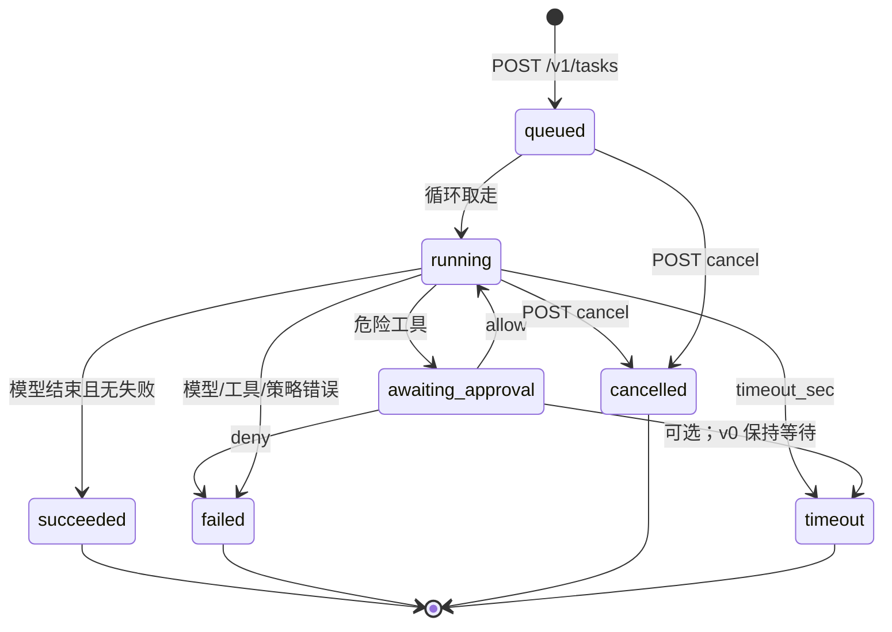

# 远端 openbot-agent

聚焦文档：常驻进程、任务状态机、HTTP 草图、1:1 / 群组如何映射到任务队列。总图与防腐化规则见 [architecture.md](architecture.md)。

## 0. 版本历史

| 版本 | 日期 | 变更内容 | 变更原因 | 影响 |
|------|------|----------|----------|------|
| v0.1 | 2026-09-20 | 初稿：单进程 Agent + 任务 API + 对话分层 | 用户确认远端是 Agent 不是哑 Worker；本地要 1:1 与群组 | 实现按 Phase 1→2→3；群组 v0.5 |

## 1. 当前决策

- 远端产品进程名叫 **`openbot-agent`**，systemd 常驻（降级 tmux / nohup）。
- **一个进程**容纳：HTTP、任务队列、模型循环、工具、审批、事件日志。
- 本机是瘦客户端：`POST` 任务、订阅事件、批准。聊天 UI 只是会话面。
- v0 工具：`run_shell`、`read_file`、`write_file`、`list_dir`。浏览器是以后的 plugin。
- v0 对话：与**一个**具名 Agent 1:1。v0.5 才做群组房间。
- 不宣称 Firecracker，不宣称 Grok 像素桌面对等。

## 2. Agent 不是什么

```text
Worker          = 只执行别人想好的步骤
openbot-agent   = 自己想 + 自己在这台电脑上做
computer-use    = 一种工具（看屏幕/点浏览器），挂在 Agent 下面
群组编排器      = 把一句话变成对多名 Agent 的投递，不代替他们思考
```

PR#1 的 `worker.py` 是合格的 **Worker**。目标是把它的执行原语收进 Agent，并在同一进程里加上模型循环，而不是再叠一个“云端大脑”。

## 3. 单进程内部

```text
                    ┌──────── openbot-agent（一个 OS 进程）────────┐
  隧道 / 本机  ───► │ HTTP : 127.0.0.1                             │
                    │   /v1/tasks  /v1/approvals  /v1/tasks/:id/events
                    │          │                                    │
                    │          ▼                                    │
                    │   队列（磁盘 tasks/*.json）                     │
                    │          │                                    │
                    │          ▼                                    │
                    │   模型循环（BYOK HTTP） ──► secrets/          │
                    │      │         │                              │
                    │      ▼         ▼                              │
                    │   工具(shell/files)   审批门                   │
                    │      │         │                              │
                    │      ▼         ▼                              │
                    │   workspace    事件日志（append-only）         │
                    └───────────────────────────────────────────────┘
```

并发策略（v0，2C4G）：**同一时刻一条模型循环**；队列里可以有多条 `queued` 任务。不要为了并行先上 worker pool。工具子进程可以有，但仍属同一 Agent 进程树。

## 4. 任务状态机



事件（SSE / 日志，字段可增不可改语义）：

| `type` | 何时 | 会话面怎么画 |
|--------|------|----------------|
| `status` | 进入 queued/running/… | 系统行 |
| `thought` | 模型自然语言 | Agent 气泡（可标“思考”） |
| `tool_start` | 将调工具 | 折叠的工具块 |
| `approval` | 需要人 | 审批卡（Approve / Deny） |
| `tool_result` | 工具返回 | 工具块结果 |
| `output` | 流式 stdout | 宿主输出 |
| `error` | 可恢复或终态错误 | 红字 |
| `done` | 任务终态 | 关闭 SSE |

`thought` 与 `token`（PR#1）同义；新实现用 `thought`，读取旧流时可兼认 `token`。

## 5. API 草图

均仅监听 `127.0.0.1`。鉴权：`Authorization: Bearer <bind token>`（`/health` 可无鉴权，与 PR#1 相同，方便 persist 探活）。

### 5.1 创建任务

`POST /v1/tasks`

```json
{
  "goal": "在工作区写一份 uname 记录",
  "agent_id": "host:default",
  "thread_id": "chat_1to1_default",
  "source": {
    "type": "chat",
    "chat_id": "chat_1to1_default",
    "message_id": "msg_01"
  },
  "timeout_sec": 600
}
```

响应 `201`：

```json
{
  "id": "tsk_a1b2c3d4e5f6",
  "status": "queued",
  "agent_id": "host:default",
  "thread_id": "chat_1to1_default"
}
```

直执（不经模型，对应今天的 `openbot run`）：`POST /v1/tasks` 加 `"mode": "exec"` + `"command"`。这仍是任务，不是第二条协议。

### 5.2 查询与事件

| 方法 | 路径 | 说明 |
|------|------|------|
| GET | `/v1/tasks` | 列表；可按 `thread_id` / `status` 过滤 |
| GET | `/v1/tasks/:id` | 快照 |
| GET | `/v1/tasks/:id/events` | `text/event-stream`；支持 `Last-Event-ID` 以便合盖后续订 |
| POST | `/v1/tasks/:id/cancel` | → `cancelled`（能杀则杀工具子进程） |

### 5.3 审批

`POST /v1/approvals/:id`

```json
{ "allow": true }
```

`:id` 来自 `approval` 事件。一次性。`allow: false` → 该任务按 architecture §6 进入 `failed`（默认）或跳过工具（若请求体带 `skip: true`，v0 可不实现）。

本机 UI 的 `POST /api/approve` **只转发**到这里。审批权威在 Agent。

### 5.4 身份

`GET /v1/info` 至少返回：`agent_id`、hostname、uname、workspace、persist、是否已配置 BYOK（布尔，**不回 key**）。

## 6. 本机会话面如何说话

### 6.1 1:1 Agent 聊天（v0）

产品：用户跟一个**具名**远端 Agent 说话（先是这台 VPS 上的默认人格；以后可以是同机多 persona）。

| 用户动作 | 运行时 |
|----------|--------|
| 打开线程 | 本机列出 `thread_id`；向 Agent `GET /v1/tasks?thread_id=` 画历史 |
| 发一条消息 | 本机写入会话缓存，并 `POST /v1/tasks`（新任务）或附在仍 `running` / `awaiting_approval` 的任务上（v0 简化：**总是新任务**，`thread_id` 相同即延续上下文） |
| 看思考 / 工具 / 审批 | `GET .../events` 画进同一条线程 |
| 批准 | 本机卡片 → `POST /v1/approvals/:id` |
| 合盖再打开 | 本机再订阅；任务早在远端跑完或仍在等批准 |

v0 上下文：该 `thread_id` 最近 N 条用户/Agent 消息 + 该 Agent 私有 memory。不在 v0 做跨 Agent 共享。

### 6.2 Agent 群组（v0.5）

房间 = 一个频道。参与者 = 一个用户 + 多名 Agent（`agent_id`，可指向不同主机）。

```json
{
  "id": "room_ship_v0",
  "title": "researcher + coder + reviewer",
  "participants": [
    { "kind": "user", "id": "local-user" },
    { "kind": "agent", "id": "researcher", "host_id": "vps-a" },
    { "kind": "agent", "id": "coder", "host_id": "vps-a" },
    { "kind": "agent", "id": "reviewer", "host_id": "vps-b" }
  ],
  "routing": "mention",
  "orchestrator": null,
  "shared_transcript": true
}
```

`routing`：

| 值 | 行为 |
|----|------|
| `mention` | 只给 `@agent_id` 的人建任务；无人被点名则只落共享发言，或系统提示“点名谁行动” |
| `orchestrator` | 本机或某台远端编排器读完房间消息，再决定谁开口、谁动手，并代为 `POST /v1/tasks` |

v0.5 **先做 `mention` + 可选本机编排器**。不要先做跨机共识或独立编排微服务。

#### 共享上下文 vs 私有记忆

| 数据 | 谁可见 | 落在哪 |
|------|--------|--------|
| 房间共享发言 | 用户 + 房间内 Agent（投递任务时带上快照或引用） | v0.5 默认本机房间日志；Agent 只存它领到的副本 |
| Agent 私有 memory | 仅该 Agent | 该主机 `~/.openbot-agent/memory/` |
| workspace 文件 | 该主机上的 Agent | 各自主机 workspace；**不自动同步跨机** |
| 审批与工具副作用 | 只在产生它的那台主机 | 该 Agent 的 tasks/events |

其他 Agent 要看见私有记忆或他机文件，必须由拥有者**发回房间**（一句话或贴路径内容）。禁止编排器偷偷读他机 `memory/`。

#### 谁可以调工具 / 谁要审批

- 只有接到任务的那个 Agent 能在**自己的主机**调工具。
- 用户发群消息 ≠ 授权所有人执行。
- 编排器只有“投递权”，没有“借他人 SSH 用户执行”的权利。
- 审批落在**该任务所在 Agent**：卡片出现在房间线程里，但 `POST /v1/approvals` 打到对应主机。v0 假设操作者就是这些主机的同一主人。

#### 群消息怎么变成远端队列

推荐默认（v0.5）：**按 Agent 拆任务（扇出）**，不是一条全局任务。

```text
用户在房间说: "@coder 补测试  @reviewer 看 diff"
        │
        ▼
  编排/路由
        ├─ POST vps-a:/v1/tasks  { agent_id:coder,     source.room_id, goal }
        └─ POST vps-b:/v1/tasks  { agent_id:reviewer,  source.room_id, goal }
```

| 方案 | 何时用 | 代价 |
|------|--------|------|
| **每 Agent 一条任务（默认）** | v0.5 | 一台挂了不影响另一台；状态机已够用 |
| 一条编排任务再向下委派 | 以后 | 要嵌套任务，先不做 |
| 房间只聊天、不建任务 | 无人点名 | 零工具副作用 |

每条任务的事件回流到**同一房间线程**（气泡上标 `agent_id`）。不要为群组再发明第二种状态机。

## 7. 与 PR#1 协议的关系

| PR#1 | 目标 |
|------|------|
| `POST /v1/jobs` `{command}` | `POST /v1/tasks` `{mode:"exec", command}` 或循环里的 tool step |
| 本机 `POST /api/chat` 调模型 | 本机只 `POST /v1/tasks`；模型在 Agent 内 |
| 本机内存聊天历史 | `thread_id` + 远端任务事件为权威；本机可缓存 |
| `worker.py` 审批在控制面 | 审批状态在任务上，`awaiting_approval` |
| `OPENAI_API_KEY` 只在笔记本 | 迁到主机 `secrets/`；本机聊天不再需要 key |

执行原语（文件 API、job 日志格式）尽量原样搬进 Agent，降低 bootstrap 重写面。

## 8. 分阶段（实现，不在本 PR 写代码）

| Phase | 做什么 | 明确不做 |
|-------|--------|----------|
| **1. 远端 Agent 循环** | 常驻进程、tasks 落盘、BYOK 循环、shell/文件、审批状态机、`/v1/tasks` + events | 群组、浏览器、拆进程 |
| **2. 瘦客户端** | 本机 UI/CLI 只创建任务、订阅、批准；**v0 1:1 会话** | 完整多 Agent 房间 |
| **3. 无头浏览 plugin** | 可选工具，2C4G 评估后再做 | 像素桌面对等、把 plugin 叫成 Agent |
| **v0.5 群组房间** | 房间模型 + mention/本机编排 + 扇出任务 | 不阻塞 Phase 1；不做跨机文件同步 |

Phase 1 的验收应能在**不打开本机 UI** 的情况下，用 curl 经隧道 `POST /v1/tasks` 后拔掉隧道，任务仍在远端走到终态或停在审批。

## 9. 诚实边界

- 审批是启发式产品门，**不是**沙箱。Agent 以 SSH 用户权限运行。
- 单进程被 OOM 杀掉时，systemd/tmux 拉起后从磁盘 `queued` / `running` 恢复；`running` 中的工具步骤默认标失败后由循环决定是否重试（v0：**不自动重试危险命令**）。
- 无密钥写入本文件。示例 JSON 不含 token。
