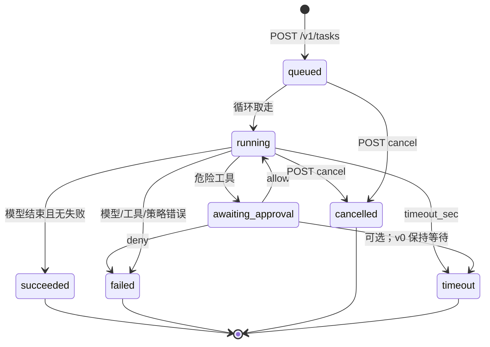

# 远端运行时与交接

聚焦文档：本机 Agent **如何交接**到远端执行后端，以及任务/事件怎么回到同一条线程。本机规划**不**走远端任务队列。总图见 [architecture.md](architecture.md) §1.0。

**v0 执行后端 = OpenHands Agent Server。** 本机薄客户端经隧道 / API 跟它说话。决策：[runtime-decision-v0.md](runtime-decision-v0.md)。试装：[openhands-agent-server-trial.md](../06-ops/openhands-agent-server-trial.md)。

下文的 `/v1/tasks` 与单进程 `openbot-agent` 图，是**产品级交接契约**和**以后 optional native** 草图，不是 v0 必自建的内核。

## 0. 版本历史

| 版本 | 日期 | 变更内容 | 变更原因 | 影响 |
|------|------|----------|----------|------|
| v0.1 | 2026-09-20 | 初稿：单进程 Agent + 任务 API + 对话分层 | 用户确认远端是 Agent 不是哑 Worker；本地要 1:1 与群组 | 实现按 Phase 1→2→3；群组 v0.5 |
| v0.2 | 2026-09-21 | 声明聊天 ≠ 总是 Agent；补本机 LLM 模式 | 同一窗口还要普通 NL 对话 | 默认不上 VPS；点选 Agent 才 `POST /v1/tasks` |
| v0.3 | 2026-09-21 | 改为交接流，不再并列三个 mode | 本机 Agent=编排；远端=电脑 | 同一线程回流；群组仍后置 |
| v0.4 | 2026-09-21 | 标明 OpenHands Agent Server 仅为临时对照运行时 | 2C4G ECS 摸手感，避免升格成内核 | 产品目标仍是本文的 `openbot-agent` |
| v0.5 | 2026-09-22 | v0 执行后端改为 OpenHands Agent Server；自建进程延后 | 用户锁定；出货速度 | 本机壳 + adapter；`openbot-agent` 不再是 v0 必做 |
| v0.6 | 2026-09-22 | 点名扩展层：桌面/VNC 由 OpenBot 外挂 | OH 无可见屏幕 | 不挡 v0；不进本文 native 草图 |

## 1. 当前决策

- **v0 执行后端是 OpenHands Agent Server**（用户 BYO Linux，已在 2C4G ECS 试装）。决策全文：[runtime-decision-v0.md](runtime-decision-v0.md)。运维：[openhands-agent-server-trial.md](../06-ops/openhands-agent-server-trial.md)。
- 本机是**薄客户端**：本机 Agent 循环 + 提出交接 + 经隧道 / API 交给 OH + 订阅事件 + 批准。不是三个对等聊天 mode。
- 用户跟**本机 Agent**说话。只有交接确认后才打到远端 runtime。本机规划不走远端队列。
- OpenHands 是 **dependency / remote Agent runtime plugin**。不 fork 整仓，不用 OH 控制台当产品隐喻。语言仍是「这台机器就是我的电脑」。
- **扩展层归 OpenBot**：OH 负责循环 / 工具 / 事件；本机壳 + 交接 + 桌面/VNC 等缺口外挂归本仓库。第一缺口是 **无可见屏幕**。挂在同一台机器、OH 旁边，见 [runtime-decision-v0.md](runtime-decision-v0.md) §3.1。**v0 不必出货桌面/VNC**。
- 自建 systemd **`openbot-agent` 延后到 v0 之后**，以后可作为 optional / native runtime。v0 **不必**自建远端循环。
- v0 工具仍只在远端（OH 侧）。本机 Agent **零 VPS 工具**。无头浏览是以后的 plugin（BL-012），与可见桌面/VNC（BL-017）分开。
- 群组后置（v0.5）。不宣称 Firecracker，不宣称 Grok 像素桌面对等。
- 禁止无鉴权绑 `0.0.0.0`。只听 `127.0.0.1`，本机用 SSH 本地转发。

## 2. Agent 不是什么

```text
本机 Agent      = 思考 / 编排同伴（规划、澄清、起草、提出交接），没有电脑
Worker          = 只执行别人想好的步骤（PR#1 worker.py）
远端 runtime    = 拥有电脑：想 + 在这台主机上做
  v0            = OpenHands Agent Server（dependency，不是本仓 fork）
  以后可选      = 自建 openbot-agent（本文 §3–5 草图）
computer-use    = 一种工具（看屏幕/点浏览器），挂在远端 runtime 下面
群组            = 以后；本机 Agent 向多名远端扇出交接
```

**不是三个对等 mode。** 默认本机 Agent 绝不创建远端任务，除非它提出交接且（策略要求时）用户确认。

PR#1 的 `worker.py` 是合格的 **Worker**。v0 不把它升格成远端大脑；执行循环先用 OH。

OpenHands Agent Server **是** v0 的远端执行后端，**不是**用户日常对谈的那一位，也不是本仓库要 fork 的产品。本机壳经隧道 / API 调用它；交接流、同一线程、先问再动手仍以本文 §6 为准。试装与卸载：[openhands-agent-server-trial.md](../06-ops/openhands-agent-server-trial.md)。

## 3. 单进程内部（以后 optional native，v0 不做）

v0 远端进程是 `openhands-agent-server`（只听 `127.0.0.1`，经 `ssh -L` 到达）。下面这张图是延后的自建 `openbot-agent`，留给以后 native runtime，不挡 v0 adapter。

```text
                    ┌──────── openbot-agent（一个 OS 进程）────────┐
  隧道 / 本机  ───► │ HTTP : 127.0.0.1                             │
                    │   /v1/tasks  /v1/approvals  /v1/tasks/:id/events
                    │          │                                    │
                    │          ▼                                    │
                    │   队列（磁盘 tasks/*.json）                     │
                    │          │                                    │
                    │          ▼                                    │
                    │   模型循环（BYOK HTTP） ──► secrets/          │
                    │      │         │                              │
                    │      ▼         ▼                              │
                    │   工具(shell/files)   审批门                   │
                    │      │         │                              │
                    │      ▼         ▼                              │
                    │   workspace    事件日志（append-only）         │
                    └───────────────────────────────────────────────┘
```

并发策略（v0，2C4G）：**同一时刻一条模型循环**；队列里可以有多条 `queued` 任务。不要为了并行先上 worker pool。工具子进程可以有，但仍属同一 Agent 进程树。

## 4. 任务状态机（产品级；v0 由 adapter 对齐 OH）



事件（SSE / 日志，字段可增不可改语义）：

| `type` | 何时 | 会话面怎么画 |
|--------|------|----------------|
| `status` | 进入 queued/running/… | 系统行 |
| `thought` | 模型自然语言 | 本机或远端气泡（标 local / remote） |
| `handoff_proposal` | 本机 Agent 要电脑 | 交接卡（确认后才 `POST /v1/tasks`） |
| `tool_start` | 将调工具 | 折叠的工具块 |
| `approval` | 需要人 | 审批卡（Approve / Deny） |
| `tool_result` | 工具返回 | 工具块结果 |
| `output` | 流式 stdout | 宿主输出 |
| `error` | 可恢复或终态错误 | 红字 |
| `done` | 任务终态 | 关闭 SSE |

`thought` 与 `token`（PR#1）同义；新实现用 `thought`，读取旧流时可兼认 `token`。`handoff_proposal` 由**本机 Agent**发出，不是远端进程的事件；列在这里是为了同一条 SSE 线程能画交接卡。

## 5. API 草图

v0 本机壳打的是 **OH Agent Server**（经隧道），不是先实现下面这组路径。这组 `/v1/tasks` 是交接契约与以后 native 的草图；adapter 负责映射。均仅监听 `127.0.0.1`。鉴权：`Authorization: Bearer <bind token>`（`/health` 可无鉴权，与 PR#1 相同，方便 persist 探活）。

### 5.1 创建任务

`POST /v1/tasks`

```json
{
  "goal": "在工作区写一份 uname 记录",
  "agent_id": "host:default",
  "thread_id": "chat_1to1_default",
  "source": {
    "type": "handoff",
    "chat_id": "chat_default",
    "message_id": "msg_01",
    "proposal_id": "ho_01"
  },
  "timeout_sec": 600
}
```

响应 `201`：

```json
{
  "id": "tsk_a1b2c3d4e5f6",
  "status": "queued",
  "agent_id": "host:default",
  "thread_id": "chat_1to1_default"
}
```

直执（不经模型，对应今天的 `openbot run`）：`POST /v1/tasks` 加 `"mode": "exec"` + `"command"`。这仍是任务，不是第二条协议。

### 5.2 查询与事件

| 方法 | 路径 | 说明 |
|------|------|------|
| GET | `/v1/tasks` | 列表；可按 `thread_id` / `status` 过滤 |
| GET | `/v1/tasks/:id` | 快照 |
| GET | `/v1/tasks/:id/events` | `text/event-stream`；支持 `Last-Event-ID` 以便合盖后续订 |
| POST | `/v1/tasks/:id/cancel` | → `cancelled`（能杀则杀工具子进程） |

### 5.3 审批

`POST /v1/approvals/:id`

```json
{ "allow": true }
```

`:id` 来自 `approval` 事件。一次性。`allow: false` → 该任务按 architecture §6 进入 `failed`（默认）或跳过工具（若请求体带 `skip: true`，v0 可不实现）。

本机 UI 的 `POST /api/approve` **只转发**到这里。审批权威在 Agent。

### 5.4 身份

`GET /v1/info` 至少返回：`agent_id`、hostname、uname、workspace、persist、是否已配置 BYOK（布尔，**不回 key**）。

## 6. 本机 Agent 如何交接

用户始终在**同一条线程**跟本机 Agent 说话。没有“Local LLM / Remote / Group”三个对等入口让人来回切。

### 6.0 本机 Agent（默认）

产品：思考 / 编排同伴。规划、澄清、起草。笔记本 BYOK。**没有电脑。**

| 用户动作 | 运行时 |
|----------|--------|
| 打开线程 | 本机 Agent；不创建远端任务 |
| 发一条消息 | 笔记本 `chat/completions`；可带 `propose_handoff` 工具（只提案，不执行） |
| 看回复 | `thought`；需要电脑时 `handoff_proposal` |
| 合盖 | 本机生成停；已交接任务继续 |

未 bind、无隧道、主机睡着：仍能规划。缺的是笔记本 BYOK。要电脑时：未 bind → 提案失败并提示先 `openbot bind`。

`handoff_proposal` 草图：

```json
{
  "type": "handoff_proposal",
  "id": "ho_01",
  "target": { "host_id": "default", "agent_id": "host:default" },
  "goal": "在工作区写一份 uname 记录",
  "reason": "需要在主机上执行 shell / 写文件",
  "thread_id": "chat_default"
}
```

### 6.1 交接与回流（v0）

| 步骤 | 运行时 |
|------|--------|
| 提案 | 本机 Agent 发 `handoff_proposal`，停等 |
| 确认 | 策略要求时：`POST /api/handoffs/ho_01` `{allow:true}`。v0 默认要确认 |
| 创建任务 | 控制面经 **runtime adapter** 把交接交给远端（v0 = OH Agent Server；以后可选 `POST /v1/tasks`）。`source.type=handoff`，**同一** `thread_id` |
| 回流 | `GET .../events` 画进同一线程，气泡标 `remote` |
| 远端审批 | 危险工具仍走 `/v1/approvals`（与交接卡分开） |
| 收尾 | 任务 `done` 后本机 Agent 再开口解释 / 下一步 |
| 合盖再打开 | 续订远端事件；本机 Agent 在终态后收尾 |

禁止：用户自己切一个“远端聊天 mode”；把提案前整段对话重放成 shell。只交 `goal` + 用户确认的上下文。

### 6.2 Agent 群组（v0.5，后置）

房间 = 一个频道。参与者 = 一个用户 + 多名 Agent（`agent_id`，可指向不同主机）。

```json
{
  "id": "room_ship_v0",
  "title": "researcher + coder + reviewer",
  "participants": [
    { "kind": "user", "id": "local-user" },
    { "kind": "agent", "id": "researcher", "host_id": "vps-a" },
    { "kind": "agent", "id": "coder", "host_id": "vps-a" },
    { "kind": "agent", "id": "reviewer", "host_id": "vps-b" }
  ],
  "routing": "mention",
  "orchestrator": null,
  "shared_transcript": true
}
```

`routing`：

| 值 | 行为 |
|----|------|
| `mention` | 只给 `@agent_id` 的人建任务；无人被点名则只落共享发言，或系统提示“点名谁行动” |
| `orchestrator` | 本机或某台远端编排器读完房间消息，再决定谁开口、谁动手，并代为 `POST /v1/tasks` |

v0.5 **先做 `mention` + 可选本机编排器**。不要先做跨机共识或独立编排微服务。

#### 共享上下文 vs 私有记忆

| 数据 | 谁可见 | 落在哪 |
|------|--------|--------|
| 房间共享发言 | 用户 + 房间内 Agent（投递任务时带上快照或引用） | v0.5 默认本机房间日志；Agent 只存它领到的副本 |
| Agent 私有 memory | 仅该 Agent | 该主机 `~/.openbot-agent/memory/` |
| workspace 文件 | 该主机上的 Agent | 各自主机 workspace；**不自动同步跨机** |
| 审批与工具副作用 | 只在产生它的那台主机 | 该 Agent 的 tasks/events |

其他 Agent 要看见私有记忆或他机文件，必须由拥有者**发回房间**（一句话或贴路径内容）。禁止编排器偷偷读他机 `memory/`。

#### 谁可以调工具 / 谁要审批

- 只有接到任务的那个 Agent 能在**自己的主机**调工具。
- 用户发群消息 ≠ 授权所有人执行。
- 编排器只有“投递权”，没有“借他人 SSH 用户执行”的权利。
- 审批落在**该任务所在 Agent**：卡片出现在房间线程里，但 `POST /v1/approvals` 打到对应主机。v0 假设操作者就是这些主机的同一主人。

#### 群消息怎么变成远端队列

推荐默认（v0.5）：**按 Agent 拆任务（扇出）**，不是一条全局任务。

```text
用户在房间说: "@coder 补测试  @reviewer 看 diff"
        │
        ▼
  编排/路由
        ├─ POST vps-a:/v1/tasks  { agent_id:coder,     source.room_id, goal }
        └─ POST vps-b:/v1/tasks  { agent_id:reviewer,  source.room_id, goal }
```

| 方案 | 何时用 | 代价 |
|------|--------|------|
| **每 Agent 一条任务（默认）** | v0.5 | 一台挂了不影响另一台；状态机已够用 |
| 一条编排任务再向下委派 | 以后 | 要嵌套任务，先不做 |
| 房间只聊天、不建任务 | 无人点名 | 零工具副作用 |

每条任务的事件回流到**同一房间线程**（气泡上标 `agent_id`）。不要为群组再发明第二种状态机。

## 7. 与 PR#1 协议的关系

| PR#1 | 目标 |
|------|------|
| `POST /v1/jobs` `{command}` | `POST /v1/tasks` `{mode:"exec", command}` 或循环里的 tool step |
| 本机 `POST /api/chat` 调模型 | **留下**给本机 Agent（规划）。交接后才 `POST /v1/tasks` |
| 本机内存聊天历史 | 一条 `thread_id`：本机规划 + 远端回流。已交接任务以远端事件为权威 |
| `worker.py` 审批在控制面 | 工具审批在远端任务上；另加本机交接确认 |
| `OPENAI_API_KEY` 只在笔记本 | **本机 Agent 仍在笔记本**。远端循环另用主机 `secrets/` |

执行原语（文件 API、job 日志格式）尽量原样搬进 Agent，降低 bootstrap 重写面。

## 8. 分阶段（实现，不在本 PR 写代码）

| Phase | 做什么 | 明确不做 |
|-------|--------|----------|
| **1. OH runtime adapter** | 本机薄客户端经隧道 / API 对接已试装的 Agent Server；交接投递、事件回流、探活 | fork OH、自建远端循环、把 OH 控制台当 UI |
| **2. 本机 Agent + 交接** | 规划同伴、`handoff_proposal`、确认、事件回流同一线程、收尾 | 三个对等 mode；静默把闲聊打到远端；完整群组 |
| **3. 无头浏览 plugin** | 可选工具，2C4G 评估后再做 | 像素桌面对等、把 plugin 叫成 Agent |
| **近端扩展：桌面/VNC** | 可选 sidecar，同一台 BYO 机器、OH 旁边 | fork OH；当成 v0 门禁；当成第二个 Agent |
| **以后 optional native** | 自建 `openbot-agent`（§3–5）与 `/v1/tasks` | 不挡 v0；不替换 BYO 电脑隐喻 |
| **v0.5 群组房间** | 房间模型 + mention/本机编排 + 扇出任务 | 不阻塞 Phase 1；不做跨机文件同步 |

Phase 1 的验收：经隧道打到 OH（至少 `/health`，再加 adapter 能投递的那条任务 API）后拔掉隧道，已交接任务仍在远端走到终态或停在审批。不必先有自建 `openbot-agent`。

## 9. 诚实边界

- 审批是启发式产品门，**不是**沙箱。Agent 以 SSH 用户权限运行。
- 单进程被 OOM 杀掉时，systemd/tmux 拉起后从磁盘 `queued` / `running` 恢复；`running` 中的工具步骤默认标失败后由循环决定是否重试（v0：**不自动重试危险命令**）。
- 无密钥写入本文件。示例 JSON 不含 token。
